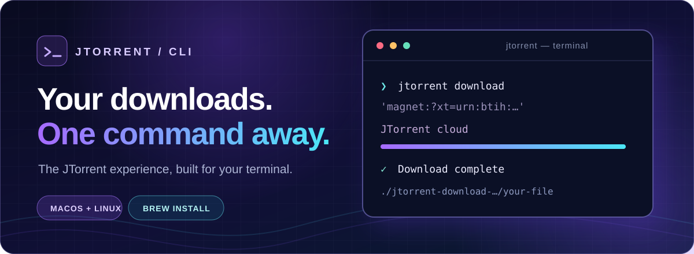

<p align="center">
  
</p>

<p align="center">
  <a href="https://jtorrent.in"></a>
</p>

<h1 align="center">JTorrent CLI</h1>

<p align="center">
  <strong>From magnet link to finished file, right from your terminal.</strong><br>
  JTorrent handles the torrent stage in the cloud. You follow the progress and get the result on your machine.
</p>

<p align="center"><strong>Free to install and use.</strong> Paid plans offer higher speeds and queue priority. <a href="https://jtorrent.in/subscriptions">Compare plans →</a></p>

<p align="center">
  <a href="https://github.com/OxJacky/jtorrent-cli/releases"></a>
  
  <a href="https://github.com/OxJacky/homebrew-tap"></a>
  
</p>

<p align="center">
  <a href="#quick-start">Quick start</a> ·
  <a href="#why-jtorrent-cli">Why JTorrent</a> ·
  <a href="#commands">Commands</a> ·
  <a href="https://jtorrent.in/subscriptions">Plans</a> ·
  <a href="https://jtorrent.in/support">Support</a>
</p>

---

## ⚡ Quick start

Install on macOS or Linux (ARM64 or AMD64) with Homebrew:

```sh
brew install OxJacky/tap/jtorrent
```

Start a download with a magnet link or a local `.torrent` file:

```sh
jtorrent download 'magnet:?xt=urn:btih:...'
# or
jtorrent download ./example.torrent
```

No subscription is needed to get started. Use the CLI as a guest or sign in to use your JTorrent plan in the terminal:

```sh
jtorrent login
jtorrent whoami
```

`jtorrent login` opens a browser for approval. If it doesn't open, the CLI prints a link and code so you can complete sign-in yourself.

## ✦ Why JTorrent CLI?

| ⚡ Free to start, faster with a plan | 🛡️ Your IP stays out of the swarm |
| --- | --- |
| Free users can download with the CLI. Paid plans add higher speed allowances and queue priority; Premium has no plan-imposed speed cap and can reach **up to 350 Mbps** in favorable conditions. [Explore plans →](https://jtorrent.in/subscriptions) | JTorrent's cloud service handles the torrent connection. Swarm peers see the service's IP address, not yours. Your connection to JTorrent still uses your IP address. |
| **☁️ No local torrent setup** | **⌁ One terminal, clear progress** |
| No separate local torrent client to configure. JTorrent handles the torrent stage and the CLI fetches your completed file. | Submit, follow the job, and watch the final transfer from the same terminal. |

Speeds aren't guaranteed; torrent availability, source peers, network conditions, and your connection affect what you actually see.

## ↳ How a download flows

```text
Magnet link or .torrent  →  JTorrent cloud download  →  File on your machine
```

The CLI shows the cloud job's status, then transfers the finished file into a new `jtorrent-download-*` folder in the directory where you ran the command. On completion, it prints the saved location.

Keep the terminal open until the transfer finishes. Pressing Ctrl+C stops the current CLI run and removes its unfinished local file; it does not remove a previously completed download.

## ⌘ Commands

| Command | What it does |
| --- | --- |
| `jtorrent download <magnet-link-or-.torrent-file>` | Submit a torrent and download the finished file here. |
| `jtorrent login` | Connect your JTorrent account through your browser. |
| `jtorrent logout` | Sign out on this machine. |
| `jtorrent whoami` | Show the signed-in account and tier. |
| `jtorrent --version` | Show the installed version. |
| `jtorrent help` | Explore commands and options. |
| `jtorrent completion <shell>` | Generate shell-completion instructions. |

Run `jtorrent <command> --help` for command-specific help.

## ↗ Stay up to date

The CLI checks for a newer release and can show an update notice. To install updates when you choose:

```sh
brew update && brew upgrade jtorrent
```

You can also download a binary from [GitHub Releases](https://github.com/OxJacky/jtorrent-cli/releases).

## ⚖ Terms and policies

The CLI uses the JTorrent service and is subject to its [Terms of Service](https://jtorrent.in/terms). Only submit content you have the right to access and download; you are responsible for the files you request.

Read the [Privacy Policy](https://jtorrent.in/privacy) for how JTorrent handles account, connection, and download information. For copyright reports and paid-plan questions, see the [DMCA / Copyright Policy](https://jtorrent.in/dmca) and [Refund Policy](https://jtorrent.in/refund-policy). Need help? Visit [Support](https://jtorrent.in/support).

---

<p align="center"><a href="https://jtorrent.in">JTorrent</a> · <a href="https://jtorrent.in/subscriptions">Plans</a> · <a href="https://jtorrent.in/support">Support</a></p>
